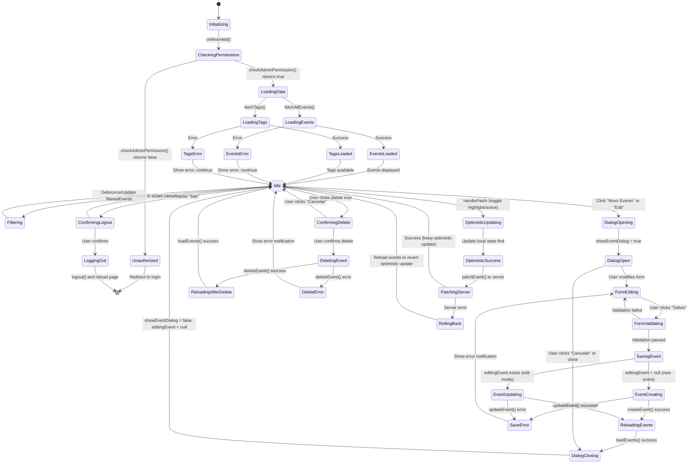

# AdminPage.vue State Machine Diagram

## Overview
The AdminPage component manages CRUD operations for events with complex state transitions involving loading, dialog management, optimistic updates, and error handling.

## State Variables
- `events[]` - Array of all events from database
- `filter` - Search filter string
- `showEventDialog` - Dialog visibility toggle
- `editingEvent` - Current event being edited (null or event object)
- `loading` - Global loading state (from useAdminEvents)
- `pagination` - Table pagination state

## State Machine Diagram

## State Transition Details

### Initial Load Flow
1. **Initializing** → **CheckingPermissions**: Component mounts and checks admin permissions
2. **CheckingPermissions** → **LoadingData**: Permission granted, proceed to load data
3. **LoadingData** → **Idle**: Both events and tags loaded successfully

### Create/Edit Event Flow
1. **Idle** → **DialogOpening**: User clicks "Novo Evento" (editingEvent = null) or "Edit" button (editingEvent = event object)
2. **DialogOpen** → **FormEditing**: Dialog displays EventForm component
3. **FormEditing** → **SavingEvent**: User submits valid form
4. **SavingEvent** → **ReloadingEvents**: Create/update API call succeeds
5. **ReloadingEvents** → **Idle**: Fresh event data loaded, dialog closes

### Delete Event Flow
1. **Idle** → **ConfirmingDelete**: User clicks delete icon on EventCard
2. **ConfirmingDelete** → **DeletingEvent**: User confirms in dialog
3. **DeletingEvent** → **ReloadingAfterDelete**: Delete API call succeeds
4. **ReloadingAfterDelete** → **Idle**: Fresh data loaded

### Optimistic Update Flow (Patch)
1. **Idle** → **OptimisticUpdating**: User toggles highlight/active status on EventCard
2. **OptimisticUpdating** → **OptimisticSuccess**: Local state updated immediately for instant UI feedback
3. **OptimisticSuccess** → **PatchingServer**: Send patch request to server
4. **PatchingServer** → **Idle**: Success - keep optimistic update
5. **PatchingServer** → **RollingBack**: Error - reload events to revert to server state

### Search/Filter Flow
1. **Idle** → **Filtering**: User types in search field
2. **Filtering** → **Idle**: Computed property `filteredEvents` updates reactively

## Key State Patterns

### Optimistic Updates
The component uses optimistic updates for patch operations:
- Updates local state immediately (lines 262-273)
- Sends patch request to server
- On error, reloads events to revert (line 284)

### Error Recovery
All error states return to **Idle** with notifications, ensuring the UI never gets stuck in an error state.

### Loading States
- Global `loading` state from useAdminEvents composable
- Controls button disable states during operations
- Prevents multiple simultaneous operations

### Dialog Management
- `showEventDialog` controls visibility
- `editingEvent` determines create vs. edit mode
- Dialog resets to first tab on open (handled in EventForm)

## Edge Cases Handled

1. **Empty State**: Shows info notification if no events exist (lines 223-230)
2. **Concurrent Operations**: Loading state disables buttons during operations
3. **Permission Denial**: Redirects to login if not admin
4. **Network Errors**: Shows error notifications but keeps UI functional
5. **Confirmation Dialogs**: Prevents accidental deletions and logouts
