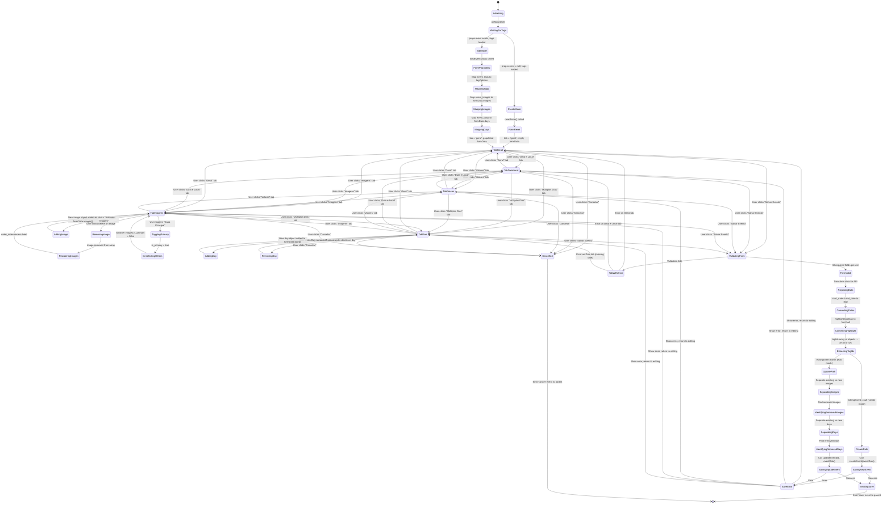

# EventForm.vue State Machine Diagram

## Overview
The EventForm component is a complex multi-tab form with dynamic arrays for images and event days. It handles both create and update modes with state transitions across tabs, field validation, and relationship management.

## State Variables
- `tab` - Currently active tab ('geral', 'data_local', 'precos', 'imagens', 'dias')
- `formData` - Complex nested object containing all form fields
  - Basic fields: title, description, location, city, state
  - Pricing: price, price_installments, installment_value
  - Contact: whatsapp, share_url, whatsapp_message
  - Flags: highlight, display_priority
  - Arrays: `tagIds[]`, `images[]`, `days[]`
- `tagOptions[]` - Available categories/tags from props
- `saving` - Save operation in progress (from useAdminEvents)

## State Machine Diagram

## State Transition Details

### Initialization Flow (Create Mode)
1. **Initializing** → **WaitingForTags**: Component mounts, waits for tags prop
2. **WaitingForTags** → **CreateMode**: No event prop provided
3. **CreateMode** → **FormReset**: Initialize with empty form
4. **FormReset** → **TabGeral**: Display first tab with empty fields

### Initialization Flow (Edit Mode)
1. **Initializing** → **WaitingForTags**: Component mounts, waits for tags prop
2. **WaitingForTags** → **EditMode**: Event prop exists
3. **EditMode** → **FormPopulating**: Call loadEventData()
4. **FormPopulating** → **MappingTags**: Map event.event_tags to selected tagOptions
5. **MappingTags** → **MappingImages**: Map event.event_images to formData.images array
6. **MappingImages** → **MappingDays**: Map event.event_days to formData.days array
7. **MappingDays** → **TabGeral**: Display first tab with populated data

### Tab Navigation Flow
All tabs can transition to any other tab. The state machine maintains:
- Current tab value (`tab` ref)
- Form data persists across tab changes
- No validation on tab switch (validation only on submit)

### Image Management Flow
1. **TabImagens** → **AddingImage**: User clicks "Adicionar Imagem"
   - New image object with default values
   - First image automatically set as primary (`is_primary: true`)
   - `order_index` set to current array length

2. **TabImagens** → **RemovingImage**: User clicks delete
   - Splice image from array
   - Recalculate `order_index` for remaining images

3. **TabImagens** → **TogglingPrimary**: User toggles "Capa Principal"
   - If setting to true: deselect all other images' `is_primary`
   - Ensures only ONE primary image exists

### Day Management Flow
1. **TabDias** → **AddingDay**: User clicks "Adicionar Dia"
   - New day object with empty fields
   - `is_active` defaults to `true`

2. **TabDias** → **RemovingDay**: User clicks delete
   - Splice day from array
   - No reordering needed (days use date for ordering)

### Save Flow (Create)
1. **Any Tab** → **ValidatingForm**: User submits form
2. **ValidatingForm** → **FormValid**: Required fields present
3. **FormValid** → **PreparingData**: Transform for API
   - Convert datetime-local to ISO strings
   - Convert highlight boolean to 'sim'/null
   - Extract tag IDs from tag objects
4. **PreparingData** → **CreatePath**: No editingEvent
5. **CreatePath** → **SavingNewEvent**: Call createEvent()
6. **SavingNewEvent** → **EmittingSave**: Emit 'save' to parent (AdminPage)

### Save Flow (Update)
1. **Any Tab** → **ValidatingForm**: User submits form
2. **ValidatingForm** → **FormValid**: Required fields present
3. **FormValid** → **PreparingData**: Transform for API
4. **PreparingData** → **UpdatePath**: editingEvent exists
5. **UpdatePath** → **SeparatingImages**: Split images into:
   - `existingImages`: Have `id` field
   - `newImages`: No `id` field
   - `removeImageIds`: Were in original but not in current form
6. **SeparatingImages** → **SeparatingDays**: Split days into:
   - `existingDays`: Have `id` field
   - `newDays`: No `id` field
   - `removeDayIds`: Were in original but not in current form
7. **SeparatingDays** → **SavingUpdateEvent**: Call updateEvent()
8. **SavingUpdateEvent** → **EmittingSave**: Emit 'save' to parent

### Error Handling
- **Validation Errors**: Return to the tab with the error
- **Save Errors**: Remain in current tab, show error notification
- Form data is preserved across error states

### Cancel Flow
User can cancel from any tab, which emits 'cancel' event to parent (closes dialog without saving)

## Key State Patterns

### Reactive Tag Options
- Watches `props.tags` for async loading
- Re-maps selected tags when options update
- Handles case where tags load after event data

### Dynamic Arrays
- Images and days use `v-for` with index-based keys
- Add/remove operations update array reactively
- Reordering handled automatically by Vue

### Primary Image Constraint
- Only ONE image can be `is_primary = true`
- Enforced in `handlePrimaryToggle()` function
- Prevents multiple primary images

### Separate Tracking for Updates
In edit mode, the form tracks:
- **Existing items** (have `id`): Update operations
- **New items** (no `id`): Create operations
- **Removed items**: Compare original vs. current arrays → Delete operations

This enables the backend to perform cascading updates correctly.

## Field Types by Tab

### Tab: Geral
- `title*` (required)
- `tagIds[]` (multi-select)
- `highlight` (toggle)
- `display_priority` (number, 1-999)
- `additional_info` (textarea)
- `description` (textarea)

### Tab: Data e Local
- `start_date` (datetime-local)
- `end_date` (datetime-local)
- `location` (text)
- `city` (text)
- `state` (text)

### Tab: Valores
- `price` (number)
- `price_installments` (number)
- `installment_value` (number)
- `whatsapp` (masked input)
- `share_url` (text)
- `whatsapp_message` (textarea)

### Tab: Imagens
- Dynamic array: `images[]`
  - `url*` (required)
  - `alt_text`
  - `image_type` (select: card/detail/both)
  - `is_primary` (toggle, only one allowed)
  - `order_index` (auto-calculated)

### Tab: Múltiplos Dias
- Dynamic array: `days[]`
  - `date*` (required)
  - `start_time`
  - `end_time`
  - `title`
  - `description`
  - `price`
  - `price_installments`
  - `installment_value`
  - `ticket_url`
  - `is_active` (toggle, defaults true)

## Edge Cases Handled

1. **Tags Load After Event**: Watcher re-maps selections when tags become available
2. **Empty Image Array**: Shows "Nenhuma imagem adicionada" message
3. **Empty Days Array**: Shows "Nenhum dia adicionado" message
4. **First Image**: Automatically set as primary
5. **Remove All Images**: Doesn't break (array becomes empty)
6. **Date Formatting**: Converts between ISO and datetime-local formats
7. **Null Values**: Properly handles null for optional fields
8. **Mobile Responsiveness**: Tabs use mobile arrows for navigation
