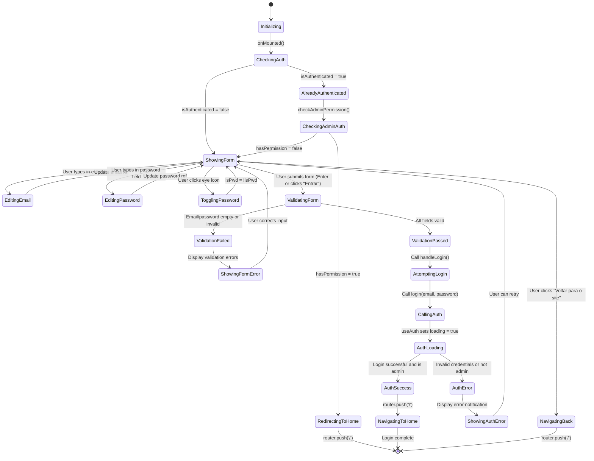

# LoginPage.vue State Machine Diagram

## Overview
The LoginPage component provides a simple login form with email/password inputs, password visibility toggle, and form validation. It delegates authentication logic to the useAuth composable and handles navigation after successful login.

## State Variables
- `email` - Email input value
- `password` - Password input value
- `isPwd` - Password visibility toggle (true = hidden, false = visible)
- `loading` - Loading state (from useAuth composable)
- `error` - Error message (from useAuth composable)

## State Machine Diagram



## State Transition Details

### Initial Load Flow
1. **Initializing** → **CheckingAuth**: Component mounts
2. **CheckingAuth** → **ShowingForm**: User not logged in, show form

**Already Authenticated**:
2. **CheckingAuth** → **AlreadyAuthenticated**: User already logged in
3. **AlreadyAuthenticated** → **CheckingAdminAuth**: Check if user is admin
4. **CheckingAdminAuth** → **RedirectingToHome**: User is admin, redirect to home
5. **RedirectingToHome** → Exit: Navigate to /

**Not Admin**:
4. **CheckingAdminAuth** → **ShowingForm**: User not admin, show login form

### Form Input Flow
1. **ShowingForm** → **EditingEmail**: User types in email field
2. **EditingEmail** → **ShowingForm**: `email` ref updated reactively

1. **ShowingForm** → **EditingPassword**: User types in password field
2. **EditingPassword** → **ShowingForm**: `password` ref updated reactively

1. **ShowingForm** → **TogglingPassword**: User clicks eye icon
2. **TogglingPassword** → **ShowingForm**: Toggle `isPwd` between true/false

### Form Submission Flow
1. **ShowingForm** → **ValidatingForm**: User submits form (click or Enter)
2. **ValidatingForm** → **ValidationPassed**: All validation rules pass
   - Email is not empty
   - Email matches pattern `/.+@.+\..+/`
   - Password is not empty
3. **ValidationPassed** → **AttemptingLogin**: Call `handleLogin()`
4. **AttemptingLogin** → **CallingAuth**: Call `login(email.value, password.value)`
5. **CallingAuth** → **AuthLoading**: useAuth composable sets `loading = true`

**Success Path**:
6. **AuthLoading** → **AuthSuccess**: Credentials valid AND user has admin role
7. **AuthSuccess** → **NavigatingToHome**: `router.push('/')`
8. **NavigatingToHome** → Exit: Login complete

**Error Path**:
6. **AuthLoading** → **AuthError**: Invalid credentials OR user not admin
7. **AuthError** → **ShowingAuthError**: Display error notification from useAuth
8. **ShowingAuthError** → **ShowingForm**: User can retry login

### Validation Error Flow
2. **ValidatingForm** → **ValidationFailed**: Validation rules fail
   - Email empty: "Email é obrigatório"
   - Email invalid format: "Email inválido"
   - Password empty: "Senha é obrigatória"
3. **ValidationFailed** → **ShowingFormError**: Quasar displays validation error messages
4. **ShowingFormError** → **ShowingForm**: User corrects input

### Cancel Flow
1. **ShowingForm** → **NavigatingBack**: User clicks "Voltar para o site"
2. **NavigatingBack** → Exit: `router.push('/')`

## Key State Patterns

### Delegated Authentication
The component delegates all authentication logic to the `useAuth` composable:
- **Loading state**: Inherited from `useAuth`
- **Error handling**: Errors displayed via useAuth's error ref
- **Notifications**: useAuth shows Quasar notifications

This keeps the component thin and focused on UI.

### Form Validation
Uses Quasar's built-in validation system:
```vue
<q-input
  :rules="[
    val => !!val || 'Email é obrigatório',
    val => /.+@.+\..+/.test(val) || 'Email inválido'
  ]"
/>
```

Validation runs:
- On blur (field loses focus)
- On submit (form submission)

### Password Visibility Toggle
```javascript
const isPwd = ref(true)

// In template:
:type="isPwd ? 'password' : 'text'"
@click="isPwd = !isPwd"
```

Toggles between:
- `type="password"` → bullets (••••)
- `type="text"` → plain text

### Loading State Management
While `loading = true`:
- Form inputs are disabled (`:disable="loading"`)
- Submit button shows loading spinner (`:loading="loading"`)
- Submit button is disabled (`:disable="loading"`)

Prevents:
- Multiple simultaneous login attempts
- Form edits during login

### Error Display
Two types of errors:
1. **Validation errors**: Displayed inline below input fields (Quasar validation)
2. **Auth errors**: Displayed in separate error div below password field

```vue
<div v-if="error" class="text-negative q-mt-sm">
  {{ error }}
</div>
```

## Validation Rules

### Email Field
- **Rule 1**: `val => !!val || 'Email é obrigatório'`
  - Checks: Email is not empty
  - Error: "Email é obrigatório"

- **Rule 2**: `val => /.+@.+\..+/.test(val) || 'Email inválido'`
  - Checks: Email contains @ and . in correct positions
  - Error: "Email inválido"

### Password Field
- **Rule 1**: `val => !!val || 'Senha é obrigatória'`
  - Checks: Password is not empty
  - Error: "Senha é obrigatória"

## Button States

### Submit Button ("Entrar")
- **Normal**: Enabled, shows "Entrar"
- **Loading**: Shows spinner, disabled, label changes to loading indicator
- **Disabled**: Cannot click (during loading or validation error)

### Cancel Button ("Voltar para o site")
- **Always enabled**: User can always navigate back
- **Flat style**: Secondary action, less visual prominence

## Navigation Behavior

### After Successful Login
- Navigates to `/` (home page)
- useAuth already verified admin role
- MainLayout will show admin controls

### If Already Logged In (onMounted)
- Checks admin permission
- If admin: Redirect to `/` immediately
- If not admin: Show login form (user will need to re-login with admin account)

### Cancel Navigation
- Returns to `/` (home page)
- Does not log out user if already authenticated

## Error Messages

### From Validation
- "Email é obrigatório"
- "Email inválido"
- "Senha é obrigatória"

### From useAuth
- "Acesso negado. Apenas administradores podem acessar." (non-admin login)
- Supabase error messages (invalid credentials, network errors)

## Auto-focus Behavior

Email field has `autofocus` attribute:
- Cursor automatically placed in email field when page loads
- Improves UX by allowing immediate typing

## Form Submission Methods

1. **Button click**: User clicks "Entrar" button
2. **Enter key**: User presses Enter in any field (triggers `@submit`)

Both trigger the same `handleLogin()` function via `<q-form @submit="handleLogin">`.

## Edge Cases Handled

1. **Already authenticated admin**: Redirects to home immediately
2. **Already authenticated non-admin**: Shows login form (needs admin login)
3. **Invalid email format**: Blocked by validation before API call
4. **Empty fields**: Blocked by validation before API call
5. **Network error during login**: Caught by useAuth, error displayed
6. **Non-admin credentials**: useAuth logs out immediately, shows error
7. **Multiple rapid submits**: Prevented by `:disable="loading"`

## Component Dependencies

### External Composables
- `useRouter` (Vue Router): Navigation
- `useAuth` (Custom): Authentication logic

### State Flow
```
LoginPage component
    ↓ (uses)
useAuth composable
    ↓ (calls)
Supabase auth API
    ↓ (returns)
User session + metadata
    ↓ (validates)
Admin role check
    ↓ (navigates)
Router push to home
```

## Styling Details

- Card has rounded corners (`border-radius: 16px`)
- Box shadow for elevation (`0 10px 30px rgba(0, 0, 0, 0.1)`)
- Centered layout with flexbox
- Max width constraint (`max-width: 400px`)
- Responsive padding (`q-pa-md`, `q-pa-lg`)

## Accessibility

- Semantic form structure (`<q-form>`)
- Icon prepends for visual identification
- Clear error messages
- Keyboard navigation support (Enter to submit)
- Auto-focus on email field
- Visible password toggle for accessibility
