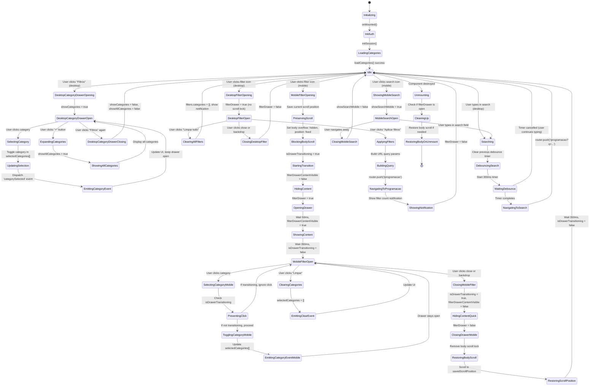

# MainLayout.vue State Machine Diagram

## Overview
The MainLayout component manages complex navigation, filtering, and drawer states with animations, mobile/desktop variations, and scroll position preservation. It coordinates category selection, search, and filter drawer behavior across the application.

## State Variables
- `showSearchMobile` - Mobile search bar visibility
- `filterDrawer` - Filter panel drawer state (open/closed)
- `filterDrawerContentVisible` - Drawer content animation state
- `selectedCategories[]` - Array of selected category labels
- `showAllCategories` - Category expansion toggle (desktop)
- `showCategories` - Desktop category drawer visibility
- `isDrawerTransitioning` - Animation transition flag (prevents race conditions)
- `savedScrollPosition` - Preserved scroll position when drawer opens
- `search` - Search query (with 300ms debounce)
- `filters.categories[]` - Applied filter categories
- `categories[]` - Available categories (from useCategories composable)

## State Machine Diagram



## State Transition Details

### Initialization Flow
1. **Initializing** → **InitAuth**: Component mounts
2. **InitAuth** → **LoadingCategories**: Initialize auth session
3. **LoadingCategories** → **Idle**: Load categories from Supabase

### Desktop Category Drawer Flow
1. **Idle** → **DesktopCategoryDrawerOpening**: User clicks "Filtros" button
2. **DesktopCategoryDrawerOpening** → **DesktopCategoryDrawerOpen**: Expand drawer with animation
3. **DesktopCategoryDrawerOpen** → **SelectingCategory**: User clicks category button
4. **SelectingCategory** → **UpdatingSelection**: Toggle category in/out of selectedCategories
5. **UpdatingSelection** → **EmittingCategoryEvent**: Dispatch custom event for child components
6. **EmittingCategoryEvent** → **DesktopCategoryDrawerOpen**: Drawer remains open (multi-select)

### Desktop Category Expansion
1. **DesktopCategoryDrawerOpen** → **ExpandingCategories**: User clicks "+" button
2. **ExpandingCategories** → **ShowingAllCategories**: Show all categories instead of first 9

### Mobile Filter Drawer Flow (Complex Animation)
1. **Idle** → **MobileFilterOpening**: User clicks filter icon
2. **MobileFilterOpening** → **PreservingScroll**: Save `window.scrollY` to `savedScrollPosition`
3. **PreservingScroll** → **BlockingBodyScroll**: Apply body styles:
   - `overflow: hidden`
   - `position: fixed`
   - `width: 100%`
   - `top: -${savedScrollPosition}px`
4. **BlockingBodyScroll** → **StartingTransition**: Set `isDrawerTransitioning = true`
5. **StartingTransition** → **HidingContent**: Set `filterDrawerContentVisible = false`
6. **HidingContent** → **OpeningDrawer**: Set `filterDrawer = true`
7. **OpeningDrawer** → **ShowingContent**: Wait 50ms, set `filterDrawerContentVisible = true`
8. **ShowingContent** → **MobileFilterOpen**: Wait 350ms, set `isDrawerTransitioning = false`

### Mobile Filter Close Flow
1. **MobileFilterOpen** → **ClosingMobileFilter**: User clicks close or backdrop
2. **ClosingMobileFilter** → **HidingContentQuick**: Set `isDrawerTransitioning = true`, `filterDrawerContentVisible = false`
3. **HidingContentQuick** → **ClosingDrawerMobile**: Set `filterDrawer = false`
4. **ClosingDrawerMobile** → **RestoringBodyScroll**: Remove body scroll lock styles
5. **RestoringBodyScroll** → **RestoringScrollPosition**: `window.scrollTo(0, savedScrollPosition)`
6. **RestoringScrollPosition** → **Idle**: Wait 350ms, set `isDrawerTransitioning = false`

### Desktop Filter Drawer Flow
1. **Idle** → **DesktopFilterOpening**: User clicks filter button
2. **DesktopFilterOpening** → **DesktopFilterOpen**: Open drawer (no scroll lock on desktop)
3. **DesktopFilterOpen** → **ApplyingFilters**: User clicks "Aplicar filtros"
4. **ApplyingFilters** → **BuildingQuery**: Create URL query string
5. **BuildingQuery** → **NavigatingToProgramacao**: Navigate to /programacao with filters
6. **NavigatingToProgramacao** → **ShowingNotification**: Show "X filtros aplicados"
7. **ShowingNotification** → **Idle**: Close drawer

### Search Flow (Desktop & Mobile)
1. **Idle** → **Searching**: User types in search input
2. **Searching** → **DebouncingSearch**: Clear previous timer
3. **DebouncingSearch** → **WaitingDebounce**: Start 300ms debounce timer
4. **WaitingDebounce** → **NavigatingToSearch**: Timer completes
5. **NavigatingToSearch** → **Idle**: Navigate to /programacao?q=searchTerm

### Category Selection Event Flow
When a category is selected:
```javascript
window.dispatchEvent(new CustomEvent('categorySelected', {
  detail: {
    category: selectedCategories[0] || null,  // Single category (legacy)
    categories: selectedCategories             // Array of all selected
  }
}))
```
Child pages (IndexPage, etc.) listen to this event and filter content accordingly.

## Key State Patterns

### Race Condition Prevention
The `isDrawerTransitioning` flag prevents:
- Multiple rapid clicks during drawer open/close
- Category selection during animation
- Overlapping drawer state changes

```javascript
// Example usage
if (isDrawerTransitioning.value) {
  return  // Ignore click during transition
}
```

### Scroll Position Preservation (Mobile)
**Problem**: iOS Safari loses scroll position when `overflow: hidden` is applied to body.

**Solution**:
1. Save scroll position before opening drawer
2. Apply `position: fixed` with negative top offset
3. Restore scroll position after closing drawer

### Cascading Animations
The drawer uses a cascade effect:
1. Drawer slides in (350ms cubic-bezier)
2. Content fades in after 50ms delay
3. Mobile category buttons animate in sequence with staggered delays

```css
.category-btn-mobile:nth-of-type(1) { animation-delay: 0.1s; }
.category-btn-mobile:nth-of-type(2) { animation-delay: 0.15s; }
/* ... */
```

### Debounced Search
Search input uses 300ms debounce to avoid excessive navigation:
- Clears previous timer on each keystroke
- Only navigates after user stops typing for 300ms
- Ignores empty search strings

### Mobile vs Desktop Behavior
**Mobile**:
- Filter drawer is fullscreen
- Body scroll is locked when drawer is open
- Categories are stacked vertically
- No "Aplicar filtros" button (selections apply immediately)

**Desktop**:
- Filter drawer is sidebar (400px)
- Body scroll is NOT locked
- CategoryFilter component with chips
- "Aplicar filtros" button to navigate

### Event-Driven Architecture
Uses custom events instead of prop drilling:
```javascript
// MainLayout emits
window.dispatchEvent(new CustomEvent('categorySelected', { ... }))

// IndexPage listens
window.addEventListener('categorySelected', (event) => { ... })
```

## Edge Cases Handled

1. **Rapid Drawer Toggling**: `isDrawerTransitioning` prevents state corruption
2. **Backdrop Click During Animation**: Ignored if transitioning
3. **Component Unmount with Drawer Open**: `onUnmounted` restores body scroll
4. **Empty Search**: Debounce check prevents navigation with empty string
5. **Route Change**: Mobile search closes when route changes
6. **Multiple Category Selection**: Supports both single and multi-select modes
7. **Category Load Failure**: Gracefully handles empty categories array
8. **Event Detail Page**: Hides search/filter UI when on event detail page

## Timing Constants

- **Debounce Timer**: 300ms
- **Mobile Drawer Animation**: 350ms (cubic-bezier)
- **Desktop Drawer Animation**: 200ms
- **Content Fade Delay**: 50ms
- **Content Fade Duration**: 300ms
- **Transition Lock Duration**: Matches animation duration

## State Synchronization

### With Router
- Search input syncs with `route.query.q`
- Filter categories sync with `route.query.categories`

### With Child Components
- `provide('selectedCategories')` shares state with children
- `provide('selectCategory')` shares selection function
- Custom events for loosely coupled communication

### With Body Element
- Body scroll state synced with drawer state (mobile only)
- Scroll position preserved across drawer open/close cycles

## Performance Optimizations

1. **Computed Properties**: `visibleCategories` memoizes category slicing
2. **Event Delegation**: Single listener for all category buttons
3. **Debounced Search**: Reduces navigation calls
4. **Conditional Rendering**: Desktop/mobile UI rendered conditionally
5. **Transition Flags**: Prevents unnecessary re-renders during animations
