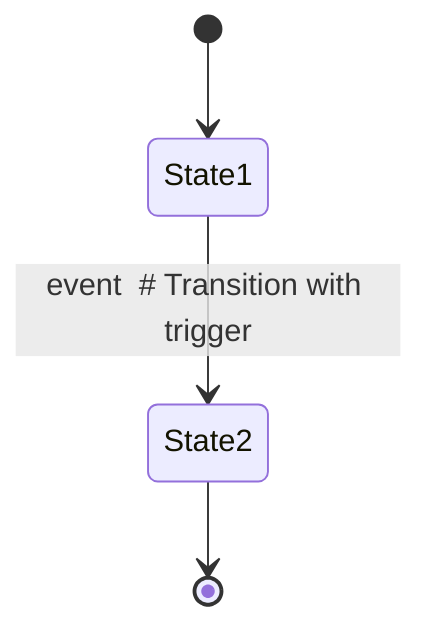

# State Machine Diagrams

This directory contains comprehensive state machine diagrams for all major stateful components in the LandingTicket application. These diagrams map out all possible states, transitions, and edge cases to provide a complete understanding of component behavior.

## Purpose

State diagrams help:
- **Verify correctness**: Ensure all possible paths are handled
- **Identify edge cases**: Discover scenarios that might be missed in testing
- **Onboard developers**: Quickly understand complex component behavior
- **Document architecture**: Provide system-level documentation
- **Debug issues**: Trace state transitions to find bugs

## Available Diagrams

### 1. [AdminPage.vue](./AdminPage.md)
**Complexity**: High
**State Variables**: 6 main states
**Key Features**:
- CRUD operations for events
- Optimistic updates with rollback
- Dialog management (create/edit modes)
- Permission checking
- Search/filter functionality

**Main Flows**:
- Initial load with permission check
- Create/edit event with form dialog
- Delete event with confirmation
- Optimistic patch updates
- Search filtering

---

### 2. [EventForm.vue](./EventForm.md)
**Complexity**: Very High
**State Variables**: Multi-tab form with nested arrays
**Key Features**:
- 5-tab navigation (Geral, Data e Local, Valores, Imagens, Múltiplos Dias)
- Dynamic arrays for images and event days
- Create vs Edit mode handling
- Relationship tracking (new/existing/removed items)
- Primary image constraint enforcement

**Main Flows**:
- Form initialization (create vs edit)
- Tab navigation with data persistence
- Image management (add/remove/reorder/primary toggle)
- Day management (add/remove)
- Form submission with data transformation
- Separate tracking for updates (existing/new/removed)

---

### 3. [MainLayout.vue](./MainLayout.md)
**Complexity**: High
**State Variables**: 10+ state management variables
**Key Features**:
- Desktop category drawer with expansion
- Mobile filter drawer with animations
- Search with 300ms debounce
- Scroll position preservation (mobile)
- Race condition prevention
- Event-driven architecture

**Main Flows**:
- Desktop category selection (expandable drawer)
- Mobile filter drawer with scroll lock
- Debounced search with navigation
- Filter application and navigation
- Animation state management
- Body scroll locking/unlocking

---

### 4. [useAuth.js](./useAuth.md)
**Complexity**: Medium-High
**Pattern**: Singleton composable
**Key Features**:
- Singleton state management
- Promise-based initialization
- Concurrent call handling
- Admin role enforcement
- Background session sync via Supabase listener

**Main Flows**:
- Singleton initialization with duplicate prevention
- Login with admin role check
- Non-admin rejection and logout
- Logout with navigation
- Permission checking
- Session retrieval for navigation guards

---

### 5. [LoginPage.vue](./LoginPage.md)
**Complexity**: Low-Medium
**State Variables**: 5 local states
**Key Features**:
- Email/password form validation
- Password visibility toggle
- Delegated authentication to useAuth
- Auto-redirect if already authenticated
- Loading state management

**Main Flows**:
- Initial auth check
- Form validation
- Login submission
- Error handling
- Navigation (success/cancel)

---

## Diagram Notation

All diagrams use Mermaid state diagram syntax (`stateDiagram-v2`). Key elements:



### Common Patterns

#### Loading State Pattern
```
Idle --> Loading: Start operation
Loading --> Success: Operation completes
Loading --> Error: Operation fails
Success --> Idle
Error --> Idle
```

#### Validation Pattern
```
Editing --> Validating: Submit
Validating --> Valid: All rules pass
Validating --> Invalid: Rules fail
Valid --> Saving
Invalid --> Editing: Show errors
```

#### Optimistic Update Pattern
```
Idle --> Optimistic: User action
Optimistic --> Patching: Update local state
Patching --> Success: Server confirms
Patching --> Rollback: Server rejects
Rollback --> Idle: Reload from server
```

## State Machine Design Principles

### 1. Explicit States
Every distinct UI mode is a separate state:
- `Idle` - Ready for user interaction
- `Loading` - Async operation in progress
- `Error` - Error state with message
- `Success` - Operation completed

### 2. Deterministic Transitions
Each transition has:
- **Trigger**: What causes the transition (user action, API response, timer)
- **Guard**: Conditions that must be met
- **Action**: Side effects during transition

### 3. Error Recovery
All error states have paths back to normal operation:
- Show error notification
- Preserve user data when possible
- Return to recoverable state (usually `Idle`)

### 4. Loading States
Operations that take time have explicit loading states:
- Disable UI during operation
- Show loading indicators
- Prevent concurrent operations

### 5. Edge Case Handling
State diagrams include paths for:
- Network errors
- Validation failures
- Permission denials
- Race conditions
- Empty states

## Component Complexity Metrics

| Component | States | Transitions | Patterns | Complexity |
|-----------|--------|-------------|----------|------------|
| AdminPage | 20+ | 35+ | CRUD, Optimistic Updates, Dialogs | High |
| EventForm | 25+ | 40+ | Multi-tab, Dynamic Arrays, Relationships | Very High |
| MainLayout | 30+ | 50+ | Animations, Scroll Lock, Debounce | High |
| useAuth | 15+ | 25+ | Singleton, Promise-based, Listeners | Medium-High |
| LoginPage | 10+ | 15+ | Form Validation, Delegation | Low-Medium |

## How to Read the Diagrams

### 1. Start with Overview
Each diagram file includes:
- **Overview**: High-level purpose
- **State Variables**: All reactive state
- **Computed State**: Derived values

### 2. Follow Main Flows
Look for the most common user paths:
- "Initial Load Flow"
- "Success Flow"
- "Error Flow"

### 3. Identify Edge Cases
Check the "Edge Cases Handled" section to see:
- What unusual scenarios are covered
- How the component recovers from errors
- What validations are in place

### 4. Understand Patterns
Look for reusable patterns:
- How does this component handle loading?
- How does it manage errors?
- What prevents race conditions?

## Integration Points

### Component Communication
- **AdminPage** → **EventForm**: Props for event data, emits for save/cancel
- **MainLayout** → **IndexPage**: Custom events for category selection
- **LoginPage** → **useAuth**: Composable for authentication
- **All components** → **useAuth**: Singleton state for user/admin checks

### Data Flow
```
User Action
    ↓
Component State Update
    ↓
Validation (if applicable)
    ↓
API Call (if needed)
    ↓
Response Handling
    ↓
State Update
    ↓
UI Update
    ↓
Notification (if applicable)
```

## Testing Implications

State diagrams help identify test cases:

1. **Happy Path**: Follow the main success flow
2. **Error Paths**: Test each error transition
3. **Edge Cases**: Test documented edge cases
4. **State Coverage**: Ensure all states are reachable
5. **Transition Coverage**: Test all state transitions

## Maintenance

When modifying components:

1. **Update Diagram**: Modify the state diagram first
2. **Review Transitions**: Ensure all new paths are documented
3. **Check Edge Cases**: Add new edge cases to the list
4. **Update Tests**: Add tests for new states/transitions
5. **Document Patterns**: Note any new patterns used

## Future Enhancements

Potential additions:
- State diagrams for IndexPage carousel management
- EventDetailPage state flows
- EventSectionCarousel scroll state
- CategoryFilter component
- useSupabaseEvents composable
- useAdminEvents CRUD operations

## Tools

These diagrams are written in Mermaid syntax and can be:
- **Rendered in GitHub**: GitHub natively supports Mermaid
- **Viewed in VS Code**: Install Mermaid extension
- **Generated as images**: Use Mermaid CLI
- **Embedded in docs**: Copy into documentation

## Contributing

When adding new stateful components:
1. Create a new `.md` file in this directory
2. Follow the existing format (Overview → Diagram → Details)
3. Include all states, transitions, and edge cases
4. Update this README with a summary entry
5. Link from component source code

## Resources

- [Mermaid State Diagram Syntax](https://mermaid.js.org/syntax/stateDiagram.html)
- [State Machine Design Patterns](https://en.wikipedia.org/wiki/State_pattern)
- [Finite State Machines in UI](https://kentcdodds.com/blog/implementing-a-simple-state-machine-library-in-javascript)
