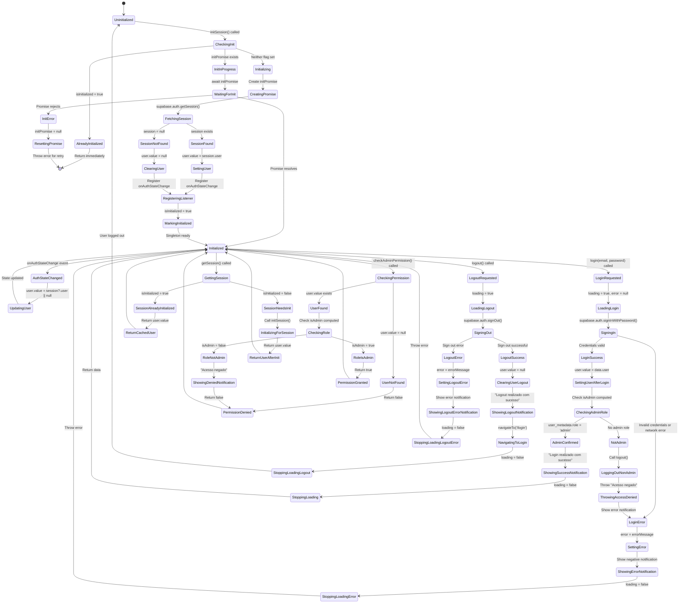

# useAuth.js Composable State Machine Diagram

## Overview
The useAuth composable manages authentication state using a singleton pattern. It prevents duplicate Supabase auth listeners, provides computed admin checks, and handles login/logout operations with proper error handling and notifications.

## State Variables (Singleton)
- `user` - Current authenticated user object (null or user)
- `loading` - Authentication operation in progress
- `error` - Error message from auth operations
- `isInitialized` - Flag to prevent duplicate initialization (module-level)
- `initPromise` - Shared promise for concurrent initialization calls (module-level)

## Computed State
- `isAuthenticated` - Boolean based on user existence
- `isAdmin` - Boolean based on user.user_metadata.role or user_metadata.is_admin

## State Machine Diagram



## State Transition Details

### Singleton Initialization Flow
1. **Uninitialized** → **CheckingInit**: First call to `initSession()`
2. **CheckingInit** → **Initializing**: No previous initialization detected
3. **Initializing** → **CreatingPromise**: Create shared `initPromise`
4. **CreatingPromise** → **FetchingSession**: Query Supabase for current session
5. **FetchingSession** → **SettingUser**: Session exists, set user
6. **SettingUser** → **RegisteringListener**: Register `onAuthStateChange` listener
7. **RegisteringListener** → **MarkingInitialized**: Set `isInitialized = true`
8. **MarkingInitialized** → **Initialized**: Ready for use

**Concurrent Calls**:
- If `initSession()` called while initialization in progress:
  - **CheckingInit** → **InitInProgress**: Detect `initPromise` exists
  - **InitInProgress** → **WaitingForInit**: Wait for shared promise
  - **WaitingForInit** → **Initialized**: All callers receive same result

**Subsequent Calls**:
- If `initSession()` called after initialization:
  - **CheckingInit** → **AlreadyInitialized**: Detect `isInitialized = true`
  - **AlreadyInitialized** → Return immediately (no-op)

### Login Flow
1. **Initialized** → **LoginRequested**: User calls `login(email, password)`
2. **LoginRequested** → **LoadingLogin**: Set `loading = true`, clear errors
3. **LoadingLogin** → **SigningIn**: Call Supabase `signInWithPassword()`
4. **SigningIn** → **LoginSuccess**: Credentials valid
5. **LoginSuccess** → **CheckingAdminRole**: Check `isAdmin` computed property
6. **CheckingAdminRole** → **AdminConfirmed**: User has admin role
7. **AdminConfirmed** → **ShowingSuccessNotification**: Show success message
8. **ShowingSuccessNotification** → **Initialized**: Return to ready state

**Non-Admin Flow**:
5. **LoginSuccess** → **CheckingAdminRole**: Check admin role
6. **CheckingAdminRole** → **NotAdmin**: No admin role found
7. **NotAdmin** → **LoggingOutNonAdmin**: Immediately log out user
8. **LoggingOutNonAdmin** → **ThrowingAccessDenied**: Throw "Acesso negado" error
9. **ThrowingAccessDenied** → **LoginError**: Show error notification
10. **LoginError** → **Initialized**: User remains logged out

**Error Flow**:
4. **SigningIn** → **LoginError**: Invalid credentials or network error
5. **LoginError** → **SettingError**: Set `error` ref with message
6. **SettingError** → **ShowingErrorNotification**: Show Quasar negative notification
7. **ShowingErrorNotification** → **Initialized**: Throw error, return to ready

### Logout Flow
1. **Initialized** → **LogoutRequested**: User calls `logout()`
2. **LogoutRequested** → **LoadingLogout**: Set `loading = true`
3. **LoadingLogout** → **SigningOut**: Call Supabase `signOut()`
4. **SigningOut** → **LogoutSuccess**: Sign out successful
5. **LogoutSuccess** → **ClearingUserLogout**: Set `user.value = null`
6. **ClearingUserLogout** → **ShowingLogoutNotification**: Show "Logout realizado com sucesso"
7. **ShowingLogoutNotification** → **NavigatingToLogin**: Navigate to /login using `window.location.href`
8. **NavigatingToLogin** → **Uninitialized**: User logged out completely

### Permission Check Flow
1. **Initialized** → **CheckingPermission**: Call `checkAdminPermission()`
2. **CheckingPermission** → **UserFound**: User exists
3. **UserFound** → **CheckingRole**: Check `isAdmin` computed
4. **CheckingRole** → **RoleIsAdmin**: Admin role confirmed
5. **RoleIsAdmin** → **PermissionGranted**: Return `true`

**Denial Flow**:
2. **CheckingPermission** → **UserNotFound**: No user logged in
3. **UserNotFound** → **PermissionDenied**: Return `false`

OR:

4. **CheckingRole** → **RoleNotAdmin**: No admin role
5. **RoleNotAdmin** → **ShowingDeniedNotification**: Show "Acesso negado" notification
6. **ShowingDeniedNotification** → **PermissionDenied**: Return `false`

### Session Retrieval Flow
1. **Initialized** → **GettingSession**: Navigation guard calls `getSession()`
2. **GettingSession** → **SessionAlreadyInitialized**: Already initialized
3. **SessionAlreadyInitialized** → **ReturnCachedUser**: Return cached `user.value`

OR:

2. **GettingSession** → **SessionNeedsInit**: Not yet initialized
3. **SessionNeedsInit** → **InitializingForSession**: Call `initSession()`
4. **InitializingForSession** → **ReturnUserAfterInit**: Return `user.value` after init

### Auth State Change (Background)
**Supabase listener fires when session changes**:
1. **Initialized** → **AuthStateChanged**: `onAuthStateChange` event
2. **AuthStateChanged** → **UpdatingUser**: Update `user.value = session?.user || null`
3. **UpdatingUser** → **Initialized**: State synchronized

This happens automatically for:
- Token refresh
- Session expiration
- Login/logout from another tab

## Key State Patterns

### Singleton Pattern
**Problem**: Multiple components call `useAuth()`, which would create duplicate listeners.

**Solution**:
- Module-level variables (`user`, `loading`, `error`)
- Shared across all `useAuth()` calls
- `isInitialized` flag prevents duplicate setup
- `initPromise` handles concurrent initialization

```javascript
// Singleton state - shared across all useAuth() calls
const user = ref(null)
const loading = ref(false)
const error = ref(null)

// Track initialization to avoid duplicate listeners
let isInitialized = false
let initPromise = null
```

### Promise-Based Initialization
All concurrent calls to `initSession()` wait on the same promise:
```javascript
if (initPromise) {
  return initPromise  // Wait for in-progress initialization
}

initPromise = (async () => {
  // ... initialization code
})()

return initPromise
```

### Admin Role Check
Uses computed property for reactive admin status:
```javascript
const isAdmin = computed(() => {
  if (!user.value) return false
  const userMetadata = user.value.user_metadata || {}
  return userMetadata.role === 'admin' || userMetadata.is_admin === true
})
```

### Safe Navigation
Uses `window.location.href` instead of Vue Router to ensure navigation works during app initialization:
```javascript
function navigateTo(path) {
  if (typeof window !== 'undefined') {
    window.location.href = `/#${path}`
  }
}
```

### Error Handling Strategy
All operations follow the pattern:
1. Set `loading = true`, clear `error`
2. Try operation
3. On success: Update state, show positive notification
4. On error: Set `error`, show negative notification, throw
5. Always: Set `loading = false` in finally block

### Non-Admin Protection
Login checks admin role **after** successful authentication:
```javascript
if (!isAdmin.value) {
  await logout()  // Remove session immediately
  throw new Error('Acesso negado')
}
```

This prevents non-admin users from accessing the app even if they have valid credentials.

## Computed Properties

### isAuthenticated
```javascript
const isAuthenticated = computed(() => !!user.value)
```
Returns `true` if any user is logged in.

### isAdmin
```javascript
const isAdmin = computed(() => {
  if (!user.value) return false
  const userMetadata = user.value.user_metadata || {}
  return userMetadata.role === 'admin' || userMetadata.is_admin === true
})
```
Returns `true` only if logged in AND has admin metadata.

## Edge Cases Handled

1. **Concurrent Initialization**: Multiple components call `initSession()` simultaneously
   - **Solution**: Shared `initPromise` ensures single initialization

2. **Initialization Failure**: Network error during session fetch
   - **Solution**: Reset `initPromise = null` to allow retry

3. **Non-Admin Login**: Valid user tries to log in without admin role
   - **Solution**: Log out immediately and show "Acesso negado" error

4. **Token Refresh**: Supabase refreshes token in background
   - **Solution**: `onAuthStateChange` listener updates `user.value` automatically

5. **Multi-Tab Logout**: User logs out in another tab
   - **Solution**: `onAuthStateChange` listener clears `user.value` in all tabs

6. **Router Not Ready**: Navigation needed before Vue Router initializes
   - **Solution**: Use `window.location.href` instead of `router.push()`

7. **getSession() Before Init**: Navigation guard checks auth before app initializes
   - **Solution**: `getSession()` calls `initSession()` if needed

## Usage Patterns

### In Components
```javascript
const { isAuthenticated, isAdmin, login, logout } = useAuth()

// All components share same singleton state
```

### In Navigation Guards
```javascript
const { getSession } = useAuth()

router.beforeEach(async (to, from, next) => {
  const user = await getSession()
  // ...
})
```

### In Layout
```javascript
const { isAdmin, initSession } = useAuth()

onMounted(async () => {
  await initSession()  // Safe to call multiple times
})
```

## Notification Types

### Success (Positive)
- "Login realizado com sucesso!"
- "Logout realizado com sucesso"

### Error (Negative)
- "Acesso negado. Apenas administradores podem acessar."
- Invalid credentials error from Supabase
- Network errors

### Info
- "Logout realizado com sucesso" (can be positive or info)

## Return Values

### initSession()
- Returns: `Promise<void>`
- Side effects: Sets `user`, `isInitialized`, registers listener

### getSession()
- Returns: `Promise<User | null>`
- Calls `initSession()` if needed

### login(email, password)
- Returns: `Promise<AuthResponse>`
- Throws: On invalid credentials or non-admin role

### logout()
- Returns: `Promise<void>`
- Side effects: Clears `user`, navigates to /login

### checkAdminPermission()
- Returns: `Promise<boolean>`
- Side effects: Shows notification if denied
